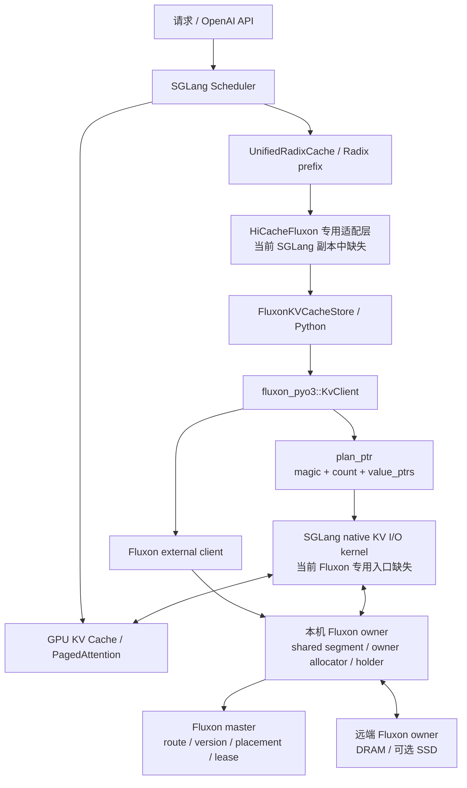
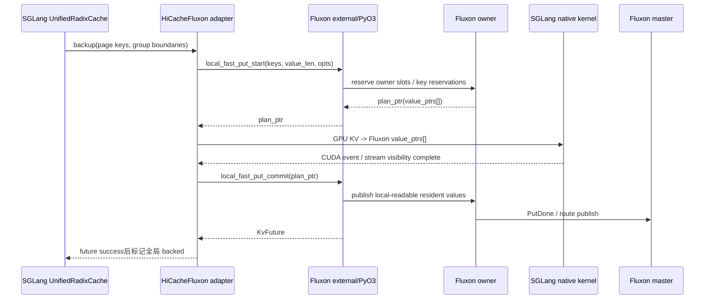
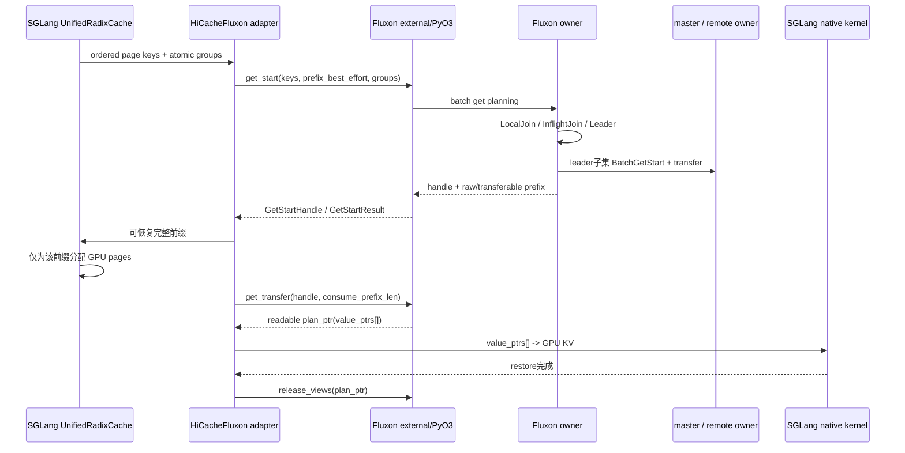
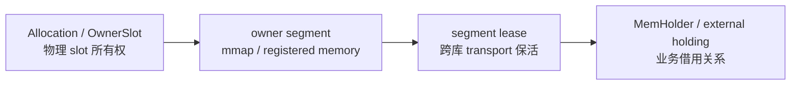

# Fluxon 与 SGLang 结合详解

> 文档范围：当前工作区 `/mnt/ceph/rjy` 中的 Fluxon、SGLang 副本及相关设计文档  
> 整理日期：2026-08-14（HKT）  
> 文档目的：说明二者为什么结合、怎样结合、核心数据流和生命周期如何工作，以及当前代码快照离“可直接部署”还有哪些缺口

## 1. 先说结论

Fluxon 与 SGLang 的结合，目标并不只是给 SGLang 增加一个普通的外部 KV 存储插件，而是重构 SGLang GPU KV Cache 之下的数据面：

- SGLang 继续负责模型执行、请求调度、Radix 前缀树、GPU KV page 分配，以及 K/V、layer、MLA、Mamba 等内部布局。
- Fluxon 负责 page key 对应 value 的本机与跨机路由、共享内存、版本、传输、holder、容量和回收。
- 两者通过短生命周期的 `plan_ptr(value_ptrs[])` 交换地址表，让 SGLang native kernel 直接在 GPU KV Cache 与 Fluxon 管理的 host memory 之间搬运数据。这条路径称为 **hostless**，其含义是 Python 不再逐页、逐层把 KV 数据物化为 `bytes`。
- 传统 HiCache 的“进程内 L2 host cache + 外部 L3 storage”被收敛为 Fluxon 的“本机 owner 数据面 + 远端 owner/SSD 数据面”，从而让同机多个 SGLang worker 共享一套 host memory 和生命周期治理。

当前快照必须同时看到两个事实：

1. **Fluxon 侧已有大量专用实现。** 当前 Fluxon 源码可见 `wait_local_segments_ready`、`local_fast_put_start/commit`、`get_start/get_transfer`、`release_views`、atomic group、GPU buffer 注册、GPU Get 和 target-free Get Plan 等接口。
2. **当前 SGLang 副本没有 Fluxon backend。** `sglang/python/sglang/srt/mem_cache/storage/` 下没有 `fluxon/`，backend factory 也没有注册 `fluxon`；SGLang 中没有调用上述 Fluxon hostless API，也没有 `write_*_to_fluxon_values` / `restore_*_from_fluxon_values` kernel 入口。

因此，当前目录保存了较完整的 Fluxon 端能力、SGLang 通用 HiCache 能力和集成设计，但**不能仅靠当前两个目录直接启动一套 SGLang–Fluxon hostless 服务**。历史端到端实验使用过独立 runtime overlay/sealed deployment；这些 overlay 按复制清单没有混入当前 `sglang/`。

## 2. 文档口径与代码快照

### 2.1 来源版本

根据 [COPY_MANIFEST.md](./COPY_MANIFEST.md)：

| 项目 | 来源状态 |
| --- | --- |
| Fluxon | 分支 `sglang-fluxon-kv-integration`，HEAD `20460ce6707c1199dca952f1b8c920c3dc5a46ae`；包含 27 个已修改 Rust 文件和未跟踪的 `owner_segment.rs` |
| SGLang | 分支 `main`，HEAD `a39ff98005e836014a34b499633a164fe0e1c2c6`；复制时工作树干净 |
| Fluxon 发布版本 | 仓库公开 release 为 `0.2.2`，但当前集成分支是未发布开发态 |

当前副本没有 Git 历史，版本号仅用于追溯来源。

### 2.2 证据等级

本文把信息分成四类：

| 标记 | 含义 |
| --- | --- |
| 当前代码事实 | 可从本工作区当前源码直接确认 |
| 当前设计合同 | 设计文档明确要求的接口、不变量或目标架构 |
| 历史实验结果 | 对应当时 sealed 代码、配置和 workload；不能自动外推到当前源码 |
| 待完成方向 | 已确定方向或已有部分代码，但尚未形成当前快照可直接运行、可发布的闭环 |

本文不会把设计目标写成已发布能力，也不会把历史 QPS 当成当前代码的性能保证。

## 3. SGLang 侧的基础：KV Cache、Radix 与 HiCache

### 3.1 GPU KV Cache

Transformer 推理主要包含：

- **Prefill/Extend**：处理输入 token，为每层生成 K/V，计算量较大。
- **Decode**：持续生成新 token，重复读取历史 K/V，更容易受到显存容量、带宽和调度延迟影响。

KV Cache 保存历史 K/V，使后续 token 不必重新计算全部前缀。多轮对话、共享 system prompt 和相似长上下文可以复用已有前缀 KV。

### 3.2 PagedAttention 与 Radix tree 的分工

SGLang 的 GPU KV 通常按 page 管理：

```text
逻辑 token 位置
  -> page table
  -> physical page
  -> page 内 offset
  -> 每层 K/V pool 中的 GPU slot
```

Radix tree 保存前缀 token/hash 与 KV slot 的索引关系。需要特别区分：

- 一个 radix node 可以覆盖多个 KV page。
- radix node 保存的是前缀和位置元数据，不是完整 KV payload。
- page hash 是存储命名的重要输入，但不能单独推出 GPU 物理地址。
- PagedAttention 解决 GPU KV 的逻辑寻址与碎片问题；它本身不会自动把 KV 搬到 CPU 或远端。

### 3.3 标准 HiCache

SGLang 文档把 HiCache 描述成三级结构：

```text
L1：GPU KV Cache
L2：SGLang 实例自己的 Host KV Cache
L3：Mooncake、HF3FS、NIXL、AIBrix 等外部 storage
```

通用工作流是：

1. 在本地 Radix/HiRadixTree 中匹配 L1/L2 连续前缀。
2. 对本地未命中的后续连续 page 查询 L3。
3. 按 `best_effort`、`wait_complete` 或 `timeout` 策略预取。
4. 将可用 KV 恢复到 GPU，再完成剩余 Prefill。
5. 按 `write_through`、`write_through_selective` 或 `write_back` 策略回写。

当前 SGLang 的通用抽象是 `HiCacheStorage`，核心接口包括：

- `batch_exists` / `batch_exists_v2`
- `batch_get_v1` / `batch_get_v2`
- `batch_set_v1` / `batch_set_v2`
- `register_mem_pool_host` / `register_mem_host_pool_v2`

这些接口以 host pool index、key 和 batch result 为中心，适合普通 L2↔L3 backend。

## 4. 为什么还需要 Fluxon 专用集成

### 4.1 传统 L2/L3 分离带来的问题

标准 HiCache 的 L2 和 L3 分别由 SGLang 与外部 backend 管理，工程上容易接入，但会带来：

- 同一批 page 可能同时占用进程内 L2 和外部 L3，容量重复计费。
- L2 的 key、驻留、pin 和驱逐对其它 worker/节点不可见。
- 同机多个 worker 可能各自维护 host pool、segment 和 holder 状态。
- 数据在 L2/L3 之间交接时会经过更多索引、包装和生命周期边界。
- 普通 `put(key, bytes)` / `get(key)` 容易在 Python/C++ 控制面产生 `page_count × layer_count` 级循环、对象构造和拷贝组织。

### 4.2 Fluxon 的收敛方式

Fluxon 将传统的 L2/L3 映射为统一数据面：

```text
SGLang L1：GPU KV Cache
       |
       | hostless kernel copy
       v
Fluxon local side：本机 owner shared segment / owner slots / holders
       |
       | RDMA/TCP/P2P/可选 SSD
       v
Fluxon remote side：其它 owner DRAM / remote-cache owner / SSD
```

这样，同机多个 SGLang worker 可以作为 external client attach 到一个 owner，共享本机数据面；远端 CPU 节点的空闲内存也能通过统一 key、route 和 holder 纳入缓存池。

## 5. 总体架构和职责边界



### 5.1 各组件负责什么

| 组件 | 负责 | 不负责 |
| --- | --- | --- |
| SGLang Scheduler/Radix | 请求调度、连续前缀、GPU page 分配、TP 协商、何时 backup/restore | Fluxon 全局 route、owner slot 回收 |
| SGLang native kernel | 解释 KV layout，在 GPU KV pool 与 `value_ptrs[]` 间搬运 | key 版本、分布式放置、holder |
| HiCacheFluxon adapter | key namespace、atomic group、两阶段 Put/Get、future 和 node 状态衔接 | owner 内存分配与跨机传输实现 |
| Fluxon external | 业务进程接入、attach 本机 owner、弱缓存、handle/plan 持有 | 集群容量贡献、owner 网状互联 |
| Fluxon owner | 本机 segment、allocator、local index、holder、P2P 数据传输 | 模型 KV page 内部布局 |
| Fluxon master | 当前 key version、route、placement、inflight、lease 和全局生命周期协调 | 业务 payload bytes |

### 5.2 Fluxon 的三角色模型

Fluxon 把状态分成：

- **master**：控制面权威。维护 `kv_routes`、`inflight_puts`、`inflight_gets`、版本、lease、holder authority 和放置决策。
- **owner**：节点数据面。持有真实 segment、slot、local cache/index、holder 和 owner 间连接。
- **external**：业务接入。零容量贡献，attach 本机 owner 的 `shared.json + mmap.file`，用本机 IPC 做控制交互，用共享 mmap 暴露 payload。

通信分层为：

- 成员发现和控制元数据：etcd。
- 本机 external↔owner：iceoryx2 控制消息 + owner shared mmap payload。
- owner↔master、owner↔owner：`P2pModule + transfer_engine`，按配置使用 RDMA 或 TCP，并可 relay。

这使连接规模主要随 owner 数量增长，而不会随每台机器上的 Python worker 数量等比例膨胀。

## 6. Key、page、value 与 layout

### 6.1 Key 命名

集成设计中的概念格式为：

```text
storage_key = key_prefix + ":" + logical_key
logical_key = page_hash
            + optional_component_suffix
            + config_suffix
            + optional_extra_backend_tag
```

各部分含义：

| 部分 | 作用 |
| --- | --- |
| `key_prefix` | backend/集群 namespace，防止业务相互污染 |
| `page_hash` | SGLang prefix page 的逻辑身份 |
| component suffix | 区分 Full KV、Mamba、SWA、Indexer 等不同 pool |
| `config_suffix` | 编入模型、TP/PP、layout 等影响字节解释方式的配置 |
| extra backend tag | 隔离实验、实例或环境 |

TP rank 的物理 key 必须能区分不同 rank 的 KV bytes；用于 replica admission 的逻辑随机身份则应去掉 rank、保留 TP size，使各 rank 对同一逻辑 group 做出一致决策。

### 6.2 Value 的边界

Fluxon 只把一个 key 映射到一段长度为 `value_len` 的连续字节，不解释其中的：

- K 与 V 如何排列；
- layer 数和每层 offset；
- MHA、GQA、MLA 的布局；
- Mamba/SWA/Indexer 等附加状态。

这些都由 SGLang 调 native kernel 时提供的 layout 参数解释。这样可避免 Fluxon 与具体模型实现强耦合。

### 6.3 page、radix node、atomic group、slot 不相等

| 概念 | 粒度 |
| --- | --- |
| page | SGLang 存取与 hash 的基本 KV 单位 |
| radix node | 一段可变长连续前缀，可覆盖多个 page |
| atomic group | backup/restore 必须完整发布的一组有序 page，通常对应一个 radix node 的 page 集合 |
| owner slot | Fluxon allocator 中承载一个 value 的物理字节区间 |

Atomic group 是发布和恢复完整性的边界；容量驱逐仍以单 key/version/slot 为基本单位。

## 7. Hostless 数据面

### 7.1 Segment registration

Fluxon owner 提供共享 segment。每个 SGLang worker 即使映射同一底层文件，也必须在自己的 CUDA context 中注册该 mapping。

`wait_local_segments_ready()` 返回的映射信息至少包括：

| 字段 | 含义 |
| --- | --- |
| `segment_label` | owner 或 external-owner mapping 标识 |
| `write_ptr` / `read_ptr` | 当前进程可访问的地址 |
| `len` | mapping 长度 |
| `generation` | owner 启动代际 |
| `node_id` | 所属 Fluxon 节点 |

External 模式应看到 `external_owner:*`。CUDA host registration 失败必须 fail closed，不能继续把未注册 host memory 当作 direct H2D/D2H 路径使用。

### 7.2 Plan blob ABI

`plan_ptr` 指向当前进程内的一段临时 plan blob：

```c
uint64_t magic;
uint64_t count;
uint64_t value_ptrs[count];
```

- `value_ptrs[i]` 是当前进程可访问的绝对地址。
- `value_len` 不存入 blob，由调用 kernel 时另行传入。
- plan 只在当前进程、当前 batch、当前操作期间有效。
- plan 不能作为 key、跨进程句柄或长期缓存地址。
- Put plan 由 `commit` 或 `abort` 消费；Get plan 由 `release_views` 释放。

Plan blob 的主要价值是让 Fluxon 只组织一次 page 地址表，SGLang kernel 再按自身 layout 批量搬运，减少 Python/C++ 热路径中逐 page、逐 layer 的控制面展开。

## 8. Hostless Put：GPU KV 写入 Fluxon

### 8.1 主时序



接口闭环：

```text
local_fast_put_start
  -> native GPU-to-host write
  -> local_fast_put_commit
  -> poll/wait KvFuture
```

### 8.2 Start 阶段的约束

- `keys` 非空。
- `value_len > 0`，同一批 key 共享相同 value size。
- `atomic_group_lens` 每项大于 0，总和等于 key 数。
- `make_replica_task_mask` 若存在，长度必须等于 key 数，且同一 atomic group 内取值一致。
- SGLang hostless 路径应开启 `reject_if_inflight_same_key` 和 `reject_if_exist_same_key`，避免同一不可变 page 重复写回。
- Start 只预留地址和 key，不得发布可被其它 owner 读取的全局 route。

如果过滤 duplicate 或处理冲突后只剩半个 atomic group，本次 group backup 应失败关闭，不能把残余 page 重新声明成完整 group。

### 8.3 两个可见性线性化点

Put 必须区分：

| 事件 | 条件 | 可见范围 |
| --- | --- | --- |
| local-read-ready | native write 完成，CUDA stream 对 host value 可见，唯一 resident `MemoryInfo` 进入本地 precommit index | 同 owner 的合法 Get 可命中 |
| global-route-ready | master 按 key/version 发布 route，相关维护完成 | 其它 owner 可发现并读取 |

Master RPC 延迟不能反向阻塞已经安全完成的同 owner读取；本地可读也不能被解释成全局已提交。

在 SGLang 调度元数据层，只有 `KvFuture` 成功后才能把 node 当作跨 worker/跨节点 shared backing。Future 失败意味着上层不能依赖该缓存；但如果 Fluxon 内部面对的是“响应丢失、对端可能已经提交”的不确定状态，仍必须保留 slot/fence，并用同一个 operation identity 向前收敛，不能猜测失败后立即释放内存。

### 8.4 Write-through、write-back 与 replica

Fluxon 设计把主数据位置与异步副本控制分开：

| 模式 | `write_through` | `make_replica_task` | 结果 |
| --- | ---: | ---: | --- |
| local-only | `false` | `false` | 主数据留在 requester 本机 owner，无异步远端副本 |
| local + remote replica | `false` | `true` | 主数据本地提交，后台按 placement 创建远端副本 |
| write-through | `true` | 不用于额外副本判断 | master 直接选择目标并完成同步远端放置语义 |

`make_replica_task_mask` 是逐 key 准入；atomic group 内必须一致。逻辑 admitted 只表示“请求创建副本”，并不自动证明远端整组已经原子提交。

### 8.5 失败与清理

- native write 失败：调用 `put_abort(plan_ptr)`。
- commit 只能消费一次 plan。
- `put_abort` 只能在 commit 前使用。
- commit 后返回的 future 必须被消费或由集成层可靠跟踪。
- TP 任一 rank 失败时，不得把其它 rank 的部分成功发布为完整可复用 KV。

## 9. Hostless Get：从 Fluxon 恢复 GPU KV

### 9.1 为什么不是逐 key Get

SGLang restore 需要回答的是：

> 对这一串有序 page keys，从开头起最多有多少 page 可以连续、安全、按完整 radix group 恢复？

因此 Fluxon 接口采用两阶段 prefix planning，而不是把每个 page 独立 `get()` 后再拼结果。

### 9.2 `GetStartResult`

| 字段 | 含义 |
| --- | --- |
| `raw_prefix_hit_len` | 按原 key 顺序连续命中的 page 数，尚未按 group 收敛 |
| `transferable_len` | 可实际消费的最长完整 atomic-group 前缀 |
| `prefix_hit_groups` | 完整命中的 group 数 |
| `first_miss_index` | 第一个 miss page 的位置 |
| `first_miss_group_index` | 第一个 miss 所在 group |
| `all_hit` | `transferable_len == len(keys)` |

例如：

```text
keys              = [p0, p1, p2, p3, p4]
atomic_group_lens = [2, 3]
raw hit           = 4 pages
transferable      = 2 pages
```

虽然前四页存在，但第二组需要三页，缺少 `p4`，所以只能恢复第一组的两页。

### 9.3 主时序



接口闭环：

```text
get_start
  -> get_transfer
  -> native host-to-GPU restore
  -> release_views
```

放弃恢复时：

```text
get_start -> cancel_get_transfer
```

### 9.4 InlineLocal 与 OwnerRpc

设计把 start-to-transfer 计划限制为两个分支：

| 分支 | 条件 | 行为 |
| --- | --- | --- |
| `InlineLocal` | 可恢复数据全部在当前 owner 本地 | Start response 直接携带 offset、len、holding ID、generation；不启动多余 transfer task |
| `OwnerRpc` | 混合命中或需要远端 materialization | owner shared op 在后台完成 prefetch，Transfer 阶段取得 readable holder/plan |

两条路径最终都生成持有 holder 强引用的 `plan_ptr`，保证 native restore 完成前地址不会被回收或复用。

### 9.5 Handle 与 plan 生命周期

- `get_start` 成功后，handle 必须被 `get_transfer` 消费，或被 `cancel_get_transfer` 取消。
- `consume_prefix_len` 必须大于 0、不超过 `transferable_len`，并精确落在 atomic-group 边界。
- 部分消费时，未消费 suffix 的 local pin、join interest 和 prepared target 要立即释放/revoke。
- `get_transfer` 成功后 handle 已关闭，后续生命周期转交给 returned plan。
- 即使 native restore 失败，也必须先 `release_views(plan_ptr)`，再执行 SGLang rollback。
- Owner generation 不匹配时，旧 inline plan 不得继续使用。

### 9.6 当前 Fluxon 中的高级读取路径

除主设计中的 CPU-hostless Get 外，当前 Fluxon concrete Python/PyO3 代码还可见：

- `register_gpu_buffer` / `unregister_gpu_buffer`
- `get_start_gpu` / `get_transfer_gpu` / `cancel_get_transfer_gpu`
- `get_plan`
- `execute_get_plan_cpu`
- `execute_get_plan_gpu`
- `cancel_get_plan`

这些接口用于注册调用方 GPU staging、把远端读取直接送入 GPU，或先做不绑定 target 的规划再选择 CPU/GPU 执行路径。它们比主设计文档中的基础 hostless 合同更新，应视为当前集成分支的高级/实验能力。当前 SGLang 副本同样没有消费这些接口的代码，因此不能据此推断 GDR 已在当前 SGLang main 中可用。

## 10. 重叠 batch、singleflight 与 batch 化

### 10.1 按 key 分流

不同请求的 page batch 往往只部分重叠。若只用完整 `keys + groups` 作为 dedup key，只能合并完全相同的 batch。

对 required batch `R`：

```text
L = 当前 owner 可立即 pin 的 local-visible keys
F = 当前 owner 已有可共享 inflight Get 的 keys

LocalJoin    = R ∩ L
InflightJoin = R ∩ F
Leader       = R - (L ∪ F)
```

Owner 必须逐 key、按 shard 短临界区决定 local/join/leader：

- LocalJoin 在离开 fence 前 clone holder，pin 住 backing。
- InflightJoin 取得 RAII interest，观察同一个终态。
- Leader 原子安装 per-key marker，防止两个重叠 batch 同时成为 leader。
- 全部 Leader 仍应压缩成一次 BatchGetStart，而不是退化为逐 key RPC。
- 返回结果按原 index scatter 回 `R`，再计算连续前缀和 atomic group。

当前设计已删除额外的 exact-batch shared-op 层；每个 external handle 直接持有自己的 BatchPlan，完全相同和部分重叠 batch 都在 per-key registry 自然合流。

### 10.2 Per-key shared op 阶段

至少要区分：

```text
Starting -> Started -> Finishing -> Ready
                    \-> Revoking -> Failed/Revoked
```

- `Starting`：leader marker 已可见，master 尚未接受。
- `Started`：已有精确 `get_id` 和 target，但 bytes 尚不能暴露给 kernel。
- `Finishing`：唯一 executor 正在 transfer/GetDone。
- `Revoking`：保留完整 operation 与 target，直到明确收敛。
- `Ready`：transfer、GetDone 和 local promotion 完成，共享 canonical `MemoryInfo`。
- `Failed/Revoked`：所有 waiter 看到同一终态，资源只释放一次。

Registry cleanup 必须比较 key 与 operation identity/generation，避免旧 waiter 延迟 Drop 删除同 key 的新 operation。

### 10.3 “控制面 batch”不等于“数据面完全 batch”

当前 Fluxon 设计/代码已经对 BatchGetStart、BatchGetDone、BatchGetRevoke 做 cohort 化；但相关分析文档明确指出，payload 阶段仍可能为每个远端 key 单独调用一次 `transfer_data_no_copy`。

因此当前准确表述是：

- 控制面已 batch；
- leader/joiner 线性化按 key；
- 底层 descriptor 是否按 peer/transport 合并，仍需实现或用运行指标验证；
- 不能仅凭 BatchGet RPC 次数宣称底层 DMA 已完全批量化。

## 11. Atomic group 与 TP 一致性

### 11.1 Atomic group 的作用

一个 radix node 可能包含多个 page。若只恢复其中一部分，SGLang 可能得到一个元数据上看似命中、实际上缺失 K/V 的 node。因此：

- Put replica admission 必须整组 admitted 或 skipped。
- Restore 只能发布完整 group。
- `transferable_len` 只能落在 group 边界。
- suffix 必须及时释放，不能靠长 TTL 最终清理。
- Atomic group 不要求容量回收时永远整组驱逐；回收仍按单 key/version 判断安全性。

### 11.2 TP 的两道门

TP 场景不能只依赖单 rank 成功：

1. **Prefix intent gate**：各 rank 对 `transferable_len` 做 collective min；最小值必须是共同 atomic-group 边界。必要时取消旧 handle，并针对共同前缀重新 `get_start`。
2. **Restore commit gate**：所有 rank 的 `get_transfer` 都成功并取得可用 plan 后，才能共同发布 restored prefix。任一 rank 失败，成功 rank 也要释放 views，并统一按 0-token miss 重算。

这两个门分别解决“准备恢复多少”和“是否真的可以发布恢复结果”。只做第一个 collective 仍可能让一侧 restore、另一侧 recompute。

## 12. 生命周期与内存安全

### 12.1 三层对象链



| 层 | 回答的问题 |
| --- | --- |
| Allocation/OwnerSlot | 这块 slot 是否仍由系统持有，何时可放回 allocator？ |
| Segment lease | 异步 transport 尚未消费地址时，segment 能否 unregister/unmap？ |
| Holder | 上层 kernel/业务是否仍在合法读取该 value？ |

三者不能相互替代。Segment lease 只保证内存段仍有效，不自动保证同一 range 的内容不会被其它业务覆盖；内容稳定还依赖 slot/holder pin。

### 12.2 External holder 释放链

External Get 返回 owner mmap 中的 offset/len/holder，而不是复制后的 bytes：

```text
ExternalMemHolder drop
  -> owner 删除 external_get_holding
  -> owner holder 引用归零
  -> owner 合批发送 delete ACK
  -> master 删除 get_holding
  -> allocation/slot 最后强引用释放
```

ACK 和失效广播按目标短窗口聚合，避免大量 page holder 同时 Drop 造成 RPC 风暴。

### 12.3 Generation 防 ABA

`holder_id`、offset 或 node id 单独都不足以抵抗 owner 重启。请求、holder、release、route 和 slot identity 需要携带或校验 `node_start_time/generation`。

当前 owner-owned 设计进一步使用：

```text
OwnerSlotId ~= (owner_id, owner_node_start_time, allocation_id)
```

其中 `allocation_id` 在一个 owner generation 内不复用，使旧 release/revoke 不能仅凭相同 offset 误释放新 slot。

### 12.4 不确定结果与幂等终态

网络超时只表示调用方没有拿到响应，不表示对端没有提交。Put/Get/replica/reclaim 必须：

- 用相同 operation ID 重试或查询终态；
- Done 与 Revoke 竞争只允许一个赢家；
- master 已接受但响应丢失时隔离 slot；
- 相同 `put_id` 的重复完成收敛到 canonical backing；
- 不同 `put_id` 才按 stale 处理；
- 取消路径用 RAII guard 归还 interest、marker 和 prepared resource。

## 13. 容量、驱逐与 owner-owned allocator

### 13.1 历史 owner-local reserve 模型

集成主文档中的成熟实验路径曾使用 512 MiB grant 作为物理容器：

```text
slot_size = align_up(max(value_len, 4 KiB), 4 KiB)
slots_per_grant = floor(512 MiB / slot_size)

Free
  -> Prepared
  -> PendingLocalVisible
  -> Committed
  -> Free
```

关键原则：

- grant 只是 arena/物理容器，不是 KV victim、atomic group 或等待单位。
- 一个 slot 只有在 `route_live == false && holder_ref_count == 0` 时才能复用。
- 逻辑 Moka 容量、真实 allocator free bytes、碎片和在途 debt 必须分别计账。
- candidate 或“预计可回收”不能冒充已经物理 Free 的容量。

### 13.2 最新目标：owner 统一拥有整段 DRAM

当前工作区的总体整理和新增 `owner_segment.rs` 指向统一架构：

- 每个 owner 永久管理自己的整段 registered DRAM。
- master 保留 topology、route、placement 和 scope 元数据，不直接拥有 owner 内每个 slot 的物理分配权。
- slot 使用 generation-safe `OwnerSlotDesc`，包含 owner generation、`allocation_id`、offset、capacity、address 和 registration epoch。
- slot scope 分为 `LocalExclusive` 与 `GlobalShared`。
- local/global 转换应只改变 scope、index 和 route，保持同一 slot 与地址，目标 payload copy 为 0。

目标状态可概括为：

```text
Reserved(operation_id, intended_scope)
  -> DataReady / RoutePending
  -> Committed(route_generation, scope)
  -> ScopeChanging 或 Reclaiming
  -> Free
```

当前源码已经有 `OwnerGeneration`、`OwnerSlotDesc`、`OwnerSlotManifestEntry`、transfer lease/receipt、scope conversion 和 owner segment transfer 协议等大量实现。但工作区自己的综合审计仍把这次 refactor 标为未完成、未验收开发态；旧 reserve/grant 路径也尚未完全收束为唯一实现。因此当前不能据此构建正式 release 或登记新的性能结论。

### 13.3 单 KV 驱逐

安全的单 KV source eviction 大致是：

1. 选择一个精确 key/version/source slot。
2. 校验 route 与 owner generation。
3. 安装 source/reclaim fence。
4. 等待真实 holder/pin 排空。
5. 删除或转换该精确 route。
6. owner 将 route ref 与 resident holder 各释放一次。
7. allocator 确认 slot 进入 Free。

有远端副本时，删除本机 source 后仍可远端命中；没有其它副本时，最后一份 cache route 也允许删除，后续按 miss/recompute 处理。远端副本失败会降低未来命中率，但不应永久阻止本机容量回收。

### 13.4 GDR 的边界

历史集成中的 GDR 同时可能改变：

- remote 数据是否直接进入 GPU staging；
- 是否创建 requester-local committed slot；
- local Moka admission 与后续命中结构；
- 网络、H2D 和 GPU copy 的组合路径。

所以 GDR-on/off 往往不是单纯的“传输协议 A/B”。要归因性能，必须同时固定 storage admission 和缓存语义。

## 14. SGLang node 元数据与 Fluxon route 的错配

### 14.1 设计期需要的状态

集成设计用下列概念区分 SGLang node 的写入阶段：

| 状态 | 含义 |
| --- | --- |
| `storage_staged` | hostless backup 已 staged |
| `storage_local_ready` | native write 已完成并进入 Fluxon commit 流程，但全局 future 未 ACK |
| `storage_pending` | Fluxon commit future 尚未结束 |
| `storage_backed` | Fluxon 全局 route 已确认，可作为 shared backing |

### 14.2 当前 SGLang main 的真实状态

当前 `UnifiedTreeNode` 只有 node 级 `storage_backed: bool`，以及通用 HiCache 使用的 pending ID。`storage_staged`、`storage_local_ready`、`storage_pending` 等 Fluxon 专用字段不存在。

此外：

- Fluxon route、holder、version 和 eviction 是 page/key 粒度。
- `storage_backed: bool` 是可变长 radix node 粒度。
- 单 page 被驱逐或部分 Put 成功时，布尔值无法表达 node 内连续可恢复前缀、洞和 generation。

设计期的保守方案是：只有 node 中所有必要 page 都可恢复时才设为 `True`，页级状态不一致时在 page 边界 split node。更可扩展的最小升级是 `storage_backed_prefix_pages: int`；更完整的表示需要 bitmap/interval + generation。

无论 SGLang 保存 bool、prefix length 还是 bitmap，它都只能作为调度提示。每次真正恢复仍应以 Fluxon `get_start/get_plan` 返回的当前逐页 route/holder 为准。

## 15. 当前 SGLang 通用 backend 为什么不能直接替代专用适配

### 15.1 Dynamic backend 能做什么

当前 SGLang 支持：

```bash
--hicache-storage-backend dynamic
--hicache-storage-backend-extra-config \
  '{"backend_name":"...","module_path":"...","class_name":"..."}'
```

Dynamic class 只要继承 `HiCacheStorage`，就能走通用 `batch_exists/batch_get/batch_set` 路径。这适合把 Fluxon包装成一个普通 L3 KV backend。

### 15.2 它不能自动得到什么

仅动态加载一个 Python backend，不能自动得到本文的专用 hostless 设计，因为当前 SGLang core：

- 不调用 `local_fast_put_start/commit`；
- 不调用 `get_start/get_transfer/release_views`；
- 不调用 `wait_local_segments_ready` 注册 Fluxon owner segment；
- 不生成 radix-node `atomic_group_lens`；
- 不维护 local-ready/global-backed 两个可见性阶段；
- 没有消费 `plan_ptr(value_ptrs[])` 的 Fluxon 专用 native kernel。

因此存在两种不同接法：

| 接法 | 改动范围 | 能力 |
| --- | --- | --- |
| 普通 dynamic L3 adapter | 主要实现 `HiCacheStorage` | 可以用 Fluxon 做普通外部 KV，但仍保留 SGLang L2，无法获得统一 L2/L3 和专用 hostless 生命周期 |
| 专用 HiCacheFluxon hostless adapter | adapter + UnifiedRadixCache/调度状态 + native kernel + TP/atomic hooks | 才能实现本文完整设计 |

## 16. 配置与预期启动顺序

### 16.1 Fluxon 服务平面

最小 KV 服务链路：

```text
Greptime -> etcd -> Fluxon KV master -> Fluxon owner -> SGLang external client
```

主要配置责任：

| 角色 | 关键配置 |
| --- | --- |
| master | `instance_key`、`cluster_name`、`etcd_endpoints`、`log_dir`、monitoring、P2P/UI 端口 |
| owner | 非零 `contribute_to_cluster_pool_size.dram`、`fluxonkv_spec.etcd_addresses`、`cluster_name`、`share_mem_path`、`sub_cluster`、`large_file_paths`、transport |
| external/SGLang | 零容量贡献、唯一 `instance_key`、与 owner 一致的 `cluster_name/share_mem_path`；其余 owner 信息从 `shared.json` 继承 |

Owner 必须先发布 `shared.json + mmap.file`，SGLang external 才能 attach。多机还要保证 owner 间 RDMA/TCP 配置、网卡和 P2P readiness 一致。

### 16.2 SGLang 通用 HiCache 参数

当前 main 提供的相关参数包括：

- `--enable-hierarchical-cache`
- `--hicache-ratio` / `--hicache-size`
- `--hicache-write-policy`
- `--hicache-io-backend`
- `--hicache-mem-layout`
- `--hicache-storage-backend`
- `--hicache-storage-prefetch-policy`
- `--hicache-storage-backend-extra-config`
- `--hicache-storage-metadata-capacity`

但当前 choices 中没有 `fluxon`，所以不能写出一个真实有效的：

```text
--hicache-storage-backend fluxon
```

命令。历史 overlay 的参数、kernel 和 adapter 身份也不在当前副本中；本工作区没有可信的一键启动命令。

### 16.3 运行时 attach/detach

SGLang 支持在服务空闲时通过 HTTP attach/detach 通用 HiCache storage backend。该控制链会创建/关闭 backend 及 prefetch/backup threads。

Fluxon 专用 hostless adapter 若未来接入此机制，还必须额外定义：

- owner segment CUDA registration/deregistration 的时机；
- live plan、holder、future 和 background task 必须为零的门禁；
- 多 DP rank 部分 attach 成功后的回滚；
- owner generation 变化时旧 mapping 的失效；
- detach 是否只停止使用，还是还要释放 external client/registered GPU buffer。

当前 SGLang 的通用 idle check 不能自动证明这些 Fluxon 专用资源已经归零。

## 17. 当前代码能力矩阵

| 能力 | Fluxon 当前源码 | SGLang 当前源码 | 当前能否端到端 |
| --- | --- | --- | --- |
| 通用 key/value、master/owner/external | 有 | 可通过普通 backend 对接 | 尚无现成 Fluxon adapter |
| `plan_ptr` ABI | 有 | 无消费入口 | 否 |
| Hostless Put start/write/commit | Python/PyO3/Rust 有 | 无调用和专用 write kernel | 否 |
| Prefix Get start/transfer/release | Python/PyO3/Rust 有 | 通用 HiCache 有 prefix 工作流，但无 Fluxon调用 | 否 |
| Atomic group | Fluxon Put/Get 有完整校验 | `HiCacheStorageExtraInfo` 只有字段声明，当前无使用点 | 否 |
| TP 共同 prefix/commit gate | 设计合同有 | 通用 HiCache有部分 rank min 同步，Fluxon专用两阶段 gate 不在 main | 否 |
| `InlineLocal` / owner shared mmap | Fluxon实现/设计有 | 无适配 | 否 |
| GPU registered buffer/GPU Get | Fluxon concrete API 有 | 无调用 | 否 |
| `storage_backed` | Fluxon route 是 page/key 粒度 | node 级 bool 有 | 粒度仍需适配 |
| Dynamic storage backend | 可编写普通 adapter | factory 支持 `dynamic` | 只能做普通 L3，不等于完整 hostless |
| Owner-owned allocator | 大量开发代码已出现 | 无需理解物理 allocator | Fluxon侧仍未验收 |
| 发布包 | `0.2.2` 是公开通用 Fluxon release | SGLang main 有通用 HiCache | `0.2.2` 不能视为已发布 SGLang–Fluxon 集成 |

一个很直接的源码证据是：当前 SGLang 中 `atomic_group_lens` 只出现在 `HiCacheStorageExtraInfo` 的字段声明；`local_fast_put_start`、`local_fast_put_commit`、`release_views`、`wait_local_segments_ready` 和 `register_gpu_buffer` 的调用数均为 0。

## 18. 历史实验说明与稳定认识

以下结果来自现有综合文档记录的历史 sealed runtime，不属于当前两个 HEAD 的可复现结果：

| 历史轮次 | Fluxon | Mooncake/对照 | 主要结论 |
| --- | ---: | ---: | --- |
| E15 早期三机 | 3.5134 QPS | 6.9192 QPS | slot 扩容到 2 的幂、0.8 水位和慢 restore 导致有效容量与命中明显不足 |
| E16z | 6.9007 | 6.9192 | exact-fit、group、restore 优化和 owner NUMA first-touch 后，单轮差距缩到 0.27% |
| E16ab 冷复测 | 6.8812 | 6.9192 | 两次 Fluxon 平均仍低约 0.41%，不能宣称超过 Mooncake |
| E16bj，200k token pool + overlap | 10.045299 | 10.153470 | 调度条件对齐后 Mooncake 高约 1.08%；早期大幅领先结论来自 scheduler 配置不公平 |

从这些实验中可以保留的工程认识：

1. **真实容量往往比传输开关更先决定结果。** 对齐名义 GiB 还不够，必须核对 payload、碎片、水位、重复 L2/L3 和实际 Free slot。
2. **命中率、网络字节与 QPS不单调。** 更高命中可能集中到一个 worker，造成 queue 和 TTFT p99 恶化。
3. **NUMA first-touch 是 hostless 大内存路径的部署合同。** Owner backing 应在 GPU-local NUMA 建立；SGLang scheduler 不宜与 owner 长期挤在同一受限 CPU 集。
4. **SGLang scheduler 配置可能比 KV 微优化影响更大。** `max_total_tokens`、overlap schedule、并发、CUDA graph 和 workload barrier 必须固定。
5. **正确性完成不等于性能完成。** Atomic group、holder 和 revoke 闭环首先保护可恢复性和内存安全，不能直接换算成 QPS 增益。
6. **性能完成也不等于容量闭环。** 请求全成功时仍可能有 retry debt、holder 或 slot 未归零。

## 19. 要形成可维护集成，还需要完成什么

### 19.1 SGLang 侧

1. 建立唯一、可审计的 `HiCacheFluxon` adapter，而不是继续依赖实验 overlay。
2. 明确 adapter 是内置 backend、外部 plugin，还是专用 cache controller；避免普通 L3 和 hostless 两套入口语义混杂。
3. 接入 segment discovery 与 CUDA host registration。
4. 接入 Put plan、native write、commit future、abort 和 node 状态机。
5. 接入 Get prefix plan、GPU page 延后分配、native restore、release/cancel。
6. 将 radix node 的 page 边界转换为 `atomic_group_lens`。
7. 补齐 TP intent gate 与 restore commit gate。
8. 解决 node 级 `storage_backed` 与 page 级 Fluxon route 的粒度错配。
9. 为 Full KV、MLA、Mamba、SWA、Indexer 等 component 定义统一 key/layout 合同。
10. 明确 attach/detach、shutdown 和 owner restart 的资源归零协议。

### 19.2 Fluxon 侧

1. 完成 owner-owned allocator、slot manifest、scope conversion 和 reclaim 的唯一主路径。
2. 删除或封存旧动态 grant/drain 等平行路径，避免两套 allocation authority。
3. 完成 master/owner 重启后的 manifest reconciliation。
4. 保证 Put/Get/replica/reclaim 对响应丢失和乱序可幂等收敛。
5. 将 payload descriptors 按 peer/transport 合并，并用指标证明 batch 化边界。
6. 固化 hostless API 的 public contract；把高级 GPU/GetPlan API 的稳定性级别写清楚。
7. 完成 wheel/native `.so` ABI、manylinux GLIBC、Python 版本和 CUDA runtime 门禁。

### 19.3 联合测试门禁

最低需要覆盖：

- all-local、same-host、remote DRAM、NoSpace 和 remote miss；
- `[a,b,c]` 与 `[b,c,d]` 的 overlap singleflight；
- identical batch 与 batch 内 duplicate key；
- atomic-group 中部 miss 和部分 prefix 消费；
- Put native write 失败、commit 响应丢失；
- Get Start/Done/Revoke 响应丢失和 Done/Revoke race；
- 任一 await 点取消、external 进程死亡、owner 重启；
- TP rank prefix 不一致、transfer 单 rank 失败、统一 rollback；
- route-first/holder-first 释放顺序；
- stale generation、旧 handle、旧 cleanup 不能影响新 slot；
- workload 后 active handle/flight、Prepared/Pending、retry/debt 和 registered buffer 全部回到基线。

性能对比还必须冻结模型、tokenizer、请求 token、顺序、并发、TP、GPU KV pool、SGLang L2、Fluxon/Mooncake 总 host 容量、router 和调度参数。

## 20. 观测指标建议

一套可诊断的联合系统至少需要同时记录：

| 层 | 指标 |
| --- | --- |
| SGLang 请求 | QPS、TTFT、E2E、queue、Prefill tokens、Decode tokens |
| 命中 | L1/L2/remote/SSD、raw prefix、transferable prefix、TP mismatch |
| Get 分流 | required、local pinned、inflight joined、leader started、suffix dropped |
| Put | staged、local ready、global committed、abort、conflict、replica admitted/completed |
| Fluxon 生命周期 | active handles/flights/interests、holder、Prepared/Pending/Committed/Free slots |
| 传输 | bytes、peer、transport、submission 数、descriptors/submission、RDMA/TCP/GDR |
| 容量 | configured、resident、payload、fragmentation、physical free、reclaim debt |
| 故障 | stale generation、retry、unknown outcome、TTL cleanup、P2P fatal、OOM/panic |

所有 gauge 都应在 workload 后有界归零。累计成功请求数或单一 QPS 不能证明生命周期闭环。

## 21. 推荐阅读顺序与源码地图

### 21.1 先读这些文档

1. [COPY_MANIFEST.md](./COPY_MANIFEST.md)：当前副本来源、包含和排除范围。
2. [push_sglang项目综合整理.md](./push_sglang项目综合整理.md)：更广的历史、实验和总体研究脉络。
3. [Fluxon README 中文版](./Fluxon/README_CN.md)：Fluxon 对外定位和三类接口。
4. [KV 设计 1：概览与分层](./Fluxon/fluxon_doc_cn/design/kv_1_概览与分层.md)：master/owner/external。
5. [KV 设计 2：调用时序](./Fluxon/fluxon_doc_cn/design/kv_2_调用时序.md)：通用 Put/Get/Delete。
6. [KV 设计 3：参数与并发](./Fluxon/fluxon_doc_cn/design/kv_3_参数与并发.md)：版本、锁和热路径。
7. [KV 设计 4：Allocation、Segment、Holder 生命周期](./Fluxon/fluxon_doc_cn/design/kv_4_allocation_segment_holder生命周期.md)。
8. [SGLang Fluxon KV 集成设计](./Fluxon/fluxon_doc_cn/design/sglang_fluxon_kv集成设计.md)：hostless 主合同。
9. [Batch Get / singleflight 与 PegaFlow 对照](./Fluxon/fluxon_doc_cn/design/sglang_fluxon_kv_PegaFlow对照与Get路径简化分析.md)。
10. [SGLang HiCache design](./sglang/docs/advanced_features/hicache_design.md) 与 [HiCache best practices](./sglang/docs/advanced_features/hicache_best_practices.md)。

### 21.2 Fluxon 代码入口

| 主题 | 路径 |
| --- | --- |
| Python hostless/API | `Fluxon/fluxon_py/kvclient/fluxon.py` |
| Python public KV contract | `Fluxon/fluxon_py/kvclient/kvclient_interface.py` |
| PyO3 plan registry与接口 | `Fluxon/fluxon_rs/fluxon_pyo3/src/lib.rs` |
| Owner/client 主状态 | `Fluxon/fluxon_rs/fluxon_kv/src/client_kv_api/mod.rs` |
| Hostless external batch Get | `Fluxon/fluxon_rs/fluxon_kv/src/client_kv_api/external_api.rs` |
| Put/Get | `Fluxon/fluxon_rs/fluxon_kv/src/client_kv_api/put.rs`、`get.rs` |
| Master route | `Fluxon/fluxon_rs/fluxon_kv/src/master_kv_router/` |
| Owner-owned slot 协议 | `Fluxon/fluxon_rs/fluxon_kv/src/owner_segment.rs` |
| Holder | `Fluxon/fluxon_rs/fluxon_kv/src/memholder/` |
| Segment/allocation | `Fluxon/fluxon_rs/fluxon_kv/src/client_seg_pool/`、`master_seg_manager/` |

### 21.3 SGLang 代码入口

| 主题 | 路径 |
| --- | --- |
| Unified Radix/HiCache | `sglang/python/sglang/srt/mem_cache/unified_radix_cache.py` |
| 通用 storage contract | `sglang/python/sglang/srt/mem_cache/hicache_storage.py` |
| Backend factory | `sglang/python/sglang/srt/mem_cache/storage/backend_factory.py` |
| HiCache controller | `sglang/python/sglang/srt/managers/cache_controller.py` |
| Host KV pool和搬运 | `sglang/python/sglang/srt/mem_cache/memory_pool_host.py` |
| Scheduler | `sglang/python/sglang/srt/managers/scheduler.py` |
| 通用 KV I/O kernel | `sglang/sgl-kernel/python/sgl_kernel/kvcacheio.py`、`sglang/sgl-kernel/csrc/kvcacheio/` |

当前目录中找不到应位于 SGLang 侧的 canonical `storage/fluxon/`、Fluxon hostless scheduler hooks 和 Fluxon 专用 kernel，这正是当前快照不能直接端到端运行的核心原因。

## 22. 术语表

| 术语 | 含义 |
| --- | --- |
| L1 | GPU HBM 中的 KV Cache |
| L2/L3 | 标准 HiCache 的进程内 host cache 与外部 storage；Fluxon 目标是统一为 local/remote 数据面 |
| hostless | Python 不物化 KV bytes；native kernel 直接访问 Fluxon 管理的 value 地址 |
| `plan_ptr` | 指向本轮 value pointer table 的临时进程内句柄 |
| local-visible | 同 owner 已安全可读，但不一定已发布全局 route |
| global committed | Master 已发布 route，跨 owner 可发现 |
| route | key/version 到 live backing/owner slot 的权威映射 |
| holder | 表示调用方仍合法借用 value 的生命周期对象 |
| segment lease | 跨库异步 transport 期间托住 mmap/registered segment 的句柄 |
| atomic group | 必须完整 backup/restore/发布的一组有序 page |
| singleflight | 同 owner 并发请求对同一 key 共用一个 leader operation 和终态 |
| `put_id` | 同一 key 的版本身份；需与 key 和 operation context 一起使用 |
| owner generation | owner 进程的一次启动代际，用于防止旧消息误操作新内存 |
| `LocalExclusive` | 只进入 owner 本地索引的 slot scope |
| `GlobalShared` | 进入 master 全局 route、可供其它 owner 读取的 slot scope |
| GDR | GPU Direct RDMA；在历史实现中还可能伴随 target/admission 变化 |

## 23. 总结

Fluxon–SGLang 集成的核心边界可以浓缩成五句话：

1. SGLang 决定哪些前缀/page 可复用，并解释 GPU KV layout。
2. Fluxon 决定这些 page 对应的 bytes 在哪里、怎样搬、何时可见、何时可回收。
3. `plan_ptr(value_ptrs[])` 把两边连接成 native hostless 数据面。
4. Local read、global route、atomic group、TP gate、holder 和 owner generation 是正确性的关键边界。
5. 当前工作区具备完整设计和大量 Fluxon 实现，但缺少当前 SGLang main 中的 canonical adapter/kernel/hooks，且 Fluxon owner-owned allocator 尚未完成发布验收，所以它是一份可继续开发和审计的集成快照，还不是开箱即用的联合发行版。
