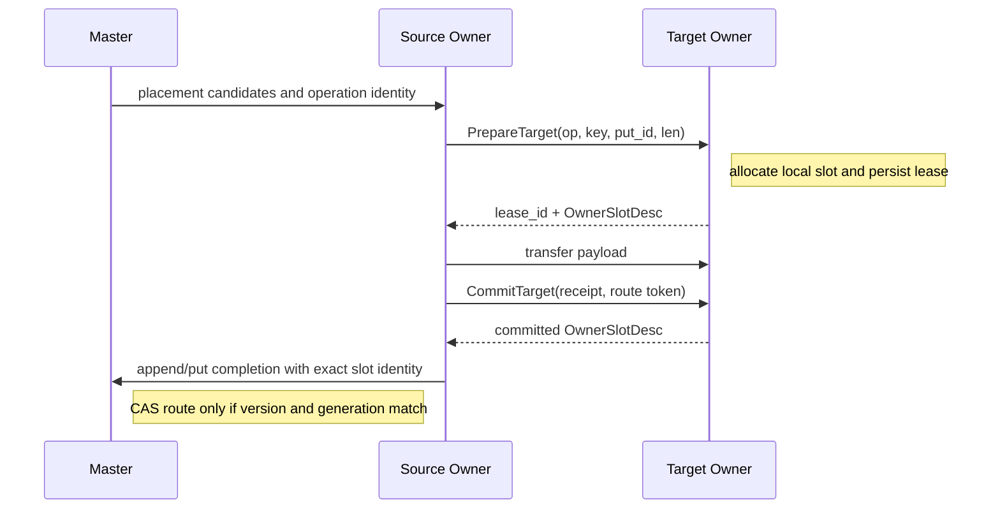
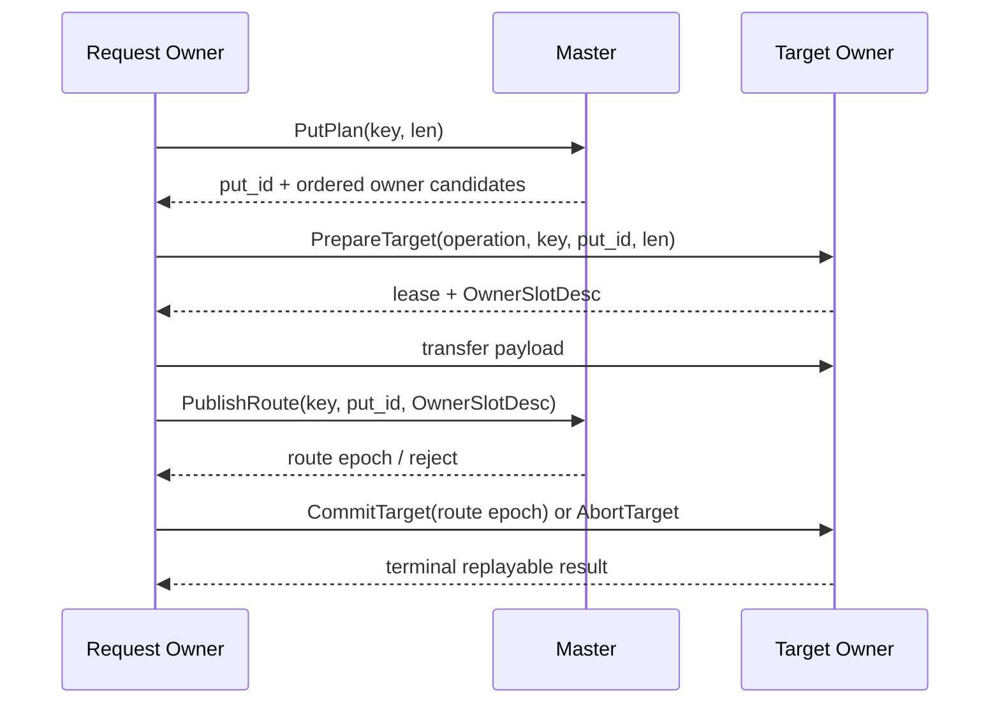

# KV 设计 5 - Master 路由、Owner 分配与回收迁移

## 结论与范围

Fluxon 已经具备迁移所需的大部分 Owner 侧基础：`OwnerSegmentAllocator` 能在 Owner 完整 DRAM segment 上分配带代际和 `allocation_id` 的 `OwnerSlotDesc`，`PrepareTarget` / `CommitTarget` / `AbortTarget` 能形成可重放的目标 slot 事务，`BatchOwnerReclaimReq` 已能让 Owner 在释放物理 slot 前执行围栏检查。

当前实现仍是混合状态。普通 `put` 与部分 `get` target 仍会由 Master 内的 `OneSegAllocator` 生成 `Allocation`；Owner-local 写入、Owner 主导的 replica append 与 committed-slot reclaim 已走 Owner slot。迁移的正确终态应为：

- Master 只保存版本、路由、成员代际、放置候选、route CAS 和回收围栏。
- Owner 是自己完整 segment 内所有物理 slot 的唯一分配者和释放者。
- Master 的 route 只引用 Owner 返回的 `OwnerSlotDesc`，不再持有可释放的 `Allocation`。
- 回收由持有物理压力和 LRU/热度信息的 Owner 发起；Master 只在相同 key-version/backing identity 上提交或拒绝 route 变更。

本文针对 `fluxon_rs/fluxon_kv`。这里的“Master 只负责路由”不表示删除版本、lease、原子组、成员代际和 route fencing；它们仍是跨 Owner 的一致性边界。本文也不改变 `external -> local owner` 的共享内存 attach 模型。

## 当前实现盘点

### 两种 allocation authority

`SegmentAllocationAuthority` 定义在 `fluxon_rs/fluxon_kv/src/master_seg_manager/msg_pack.rs`：

| 分支 | 物理分配位置 | Master 保存的资源状态 | 主要落点 |
| --- | --- | --- | --- |
| `Master` | Master 的 `MasterSegManager -> OneSegAllocator` | `Allocation` 及其 allocator 生命周期 | 普通 `PutStart`、部分 `GetStart` target |
| `Owner` | Owner 的 `OwnerSegmentAllocator` | segment 注册容量、Owner generation、route 元数据 | owner-local reserve、owner replica append、committed-slot reclaim |

Owner 模式由 `replica_writeback_hot_capacity_ratio` 启用：`fluxon_rs/fluxon_kv/src/lib.rs` 在 Owner 初始化时同时把 `ClientSegPoolNewArg.allocation_authority` 与 `ClientKvApiNewArg.allocation_authority` 设为 `Owner`。注册阶段会验证 Owner 模式只有一个非空且 4 KiB 对齐的 CPU segment，并要求提交 `owner_local_target_bytes`；见 `master_seg_manager/mod.rs`。

这说明容量注册已经能在不创建 Master allocator 的条件下完成。当前阻塞点不在 segment 注册，而在普通读写的计划和提交协议仍允许 `Allocation` 进入 route。

### 已完成的 Owner 侧能力

`client_kv_api/mod.rs` 中的 `OwnerSegmentAllocator` 已维护完整 segment 的空闲区、不可复用的 `allocation_id`、prepare/commit/abort lease、manifest 及物理状态。`OwnerSlotDesc` 包含：

- `OwnerGeneration { node_id, node_start_time }`；
- `allocation_id`、segment offset、capacity、地址及 registration epoch；
- value length 与 route/transfer 所需的 identity。

因此 offset 本身不具备释放能力；同一 Owner 代际内也不能把旧 offset 当成新 slot。`owner_segment.rs` 明确规定 `allocation_id` 在一个 Owner generation 内不复用。

现有 Owner 目标事务为：

其中 `PrepareTarget`、`CommitTarget`、`AbortTarget` 的 wire type 在 `owner_segment.rs`，RPC 执行和响应 identity 检查在 `client_kv_api/put.rs`。Owner 持有 slot lease，使 RPC 超时后可按 operation identity 重放或 abort，地址不参与资源存活判断。

### 尚未迁完的中心化路径

`master_kv_router/mod.rs` 的 `InflightPutAllocation` 仍包含 `Local(Allocation)`、`Remote { src, target }`。更直接的标记是 `InflightReplicaTarget::MasterAllocation` 的注释：它是“普通 Put 的过渡路径”，将在普通 Put 也使用 Owner `PrepareTarget` 后删除。`InflightReplicaTarget::OwnerCandidates` 已表示 Master 只给出有序 Owner 候选、由目标 Owner 完成真实 claim。

同样，`InflightGetTarget` 仍同时支持 `Allocation`、`PreparedLocalReserveSlot`、`ReusedCommittedSlot` 和 `ExternalSink`。`GetStart` 的 Owner-local reserve branch 已证明 target 可以先由请求 Owner 准备、再交由 Master 做 route/version 校验；普通 allocation target 尚未全部切换。

当前回收也是混合的：

- `OwnerReclaimBacking::CommittedSlot` 可由 Owner slot 标识物理 backing；Owner 的 `Prepare -> Commit -> Finalize` 负责实际释放。
- `OwnerReclaimBacking::Allocation` 和 `UnindexedAllocation` 仍对应 Master `Allocation` 生命周期。
- `master_kv_router/reclaim.rs` 现在驱动 `BatchOwnerReclaimReq`，也就是说 Master 仍承担一部分批次发起和重试责任。

迁移完成前，任何文档或指标都不能把 `Owner` authority 分支描述为“全量 KV 路径已经去中心化”。

## 目标协议

### 状态边界

| 状态 | Owner | Master |
| --- | --- | --- |
| segment 空闲区、slot id、slot lease、物理释放 | 唯一写入者 | 无 allocator、无 free-list |
| `key, put_id -> OwnerSlotDesc` 本地 manifest | 保存并按 Owner generation 校验 | 可据提交结果建立全局 route |
| key 当前版本、replica 集、lease、atomic group | 只保存本机副本观察 | 唯一的跨 Owner 提交者 |
| placement | 提供容量/忙碌度等可验证摘要 | 选择有序候选集合，不分配地址 |
| 驱逐候选和实际压力 | 选择 victim、执行本地 holder/slot 检查 | 验证 route identity、安装/解除 fence |

Master 仍然是“路由提交者”，避免两个 Owner 对同一 key-version 发布冲突；Owner 是“物理 slot owner”，避免远端控制面维护另一套 allocator/free-list。

### 普通 Put 的终态

普通 Put 应删除 Master target allocation。建议将 `PutStart` 拆成固定的三步，保持一个主路径：

1. Master 分配 `put_id`、取得 key activity/reservation，并返回目标 Owner candidates、候选 generation 与一次性 operation identity。
2. 发起 Owner 向选中的 target 发送 `PrepareTarget`；target 以自身 allocator 创建 `OwnerSlotDesc`。`NoSpace` 时只尝试候选表中下一项，候选耗尽才失败。
3. 传输完成后，target 先将 slot 置为 `RoutePending`；Master 对 `key + put_id + OwnerSlotDesc` 做 compare-and-publish，成功后 target `CommitTarget`，失败或超时走幂等 `AbortTarget` 或重放提交。

为消除 route 可见却 slot 已释放的窗口，建议把第 3 步实现为已有两阶段回收相同的 fenced transaction：Master 的成功响应应携带 route epoch；Owner 只接受与其 `OwnerSlotDesc`、operation identity 和 generation 全部匹配的 route token。Master 可在 route CAS 成功后返回提交 token，Owner 对 token 落盘并转为 `Committed`。重放必须返回原始终态，不能重新分配 slot。

路由发布前，slot 只能作为本次写入的私有 writable backing；发布成功后才进入读路径。对于请求 Owner 就是 target Owner 的情况，传输可折叠为本地写入，协议身份和提交顺序保持不变。

### Get target 的终态

Master 先读取当前 route、选择 source 和目标 Owner candidates；请求 Owner 再为自己准备可写 slot。`GetStart` 需要接收或绑定 Owner 返回的 `OwnerSlotDesc`，不再返回 Master `Allocation`。

- 已有本地 committed slot：复用 exact `OwnerSlotDesc`，仅递增 holder/lease。
- 要物化 durable replica：请求 Owner `PrepareTarget`，成功后传输，再用 `put_id + backing identity` 把 replica 加进 route。
- 临时读：Owner 也可分配 ephemeral slot；它不得进入稳定 replica route，holder 归零后由 Owner 释放。
- `external` caller-owned sink 继续是特殊分支；它不是 Owner segment slot，不应伪装成 `OwnerSlotDesc`。

这样 `InflightGetTarget::Allocation` 可被 `PreparedOwnerSlot` 和 `ReusedOwnerSlot` 取代，Master 的 `get_holding` 只记录 `OwnerSlotDesc` 加 holder identity。

### Owner 发起的回收

Owner 不能单方面删路由；正确顺序仍需把 route fence 保留在 Master：

1. Owner 的 hot/LRU/pressure actor 选出 exact victim cohort，带上 key、put id、`OwnerSlotDesc`、route epoch 和回收原因。
2. Owner 在本地执行 `Prepare`：拒绝有真实 holder、传输 lease、更新中 put/get 或代际不匹配的 victim。
3. Owner 向 Master 提交 `ReclaimIntent`。Master 只检查当前 route 是否仍精确引用同一 backing，并为该 cohort 安装 key activity/reclaim fence；不选择 victim、不分配替代内存。
4. Master 删除或降级匹配的 route replica，返回 route commit token；Owner 以 token `Commit` 物理释放 slot，最后 `Finalize`。
5. RPC 不确定时，Owner 重放同一 identity；若 Master 尚未提交，Owner abort 并继续持有 slot；若 Master 已提交，Owner 只能 roll-forward 释放，不能恢复旧 route。

现有 `OwnerReclaimItem`、`OwnerReclaimBacking::CommittedSlot`、`OwnerReclaimPhase::{Prepare, Commit, Abort, Finalize}` 和 exact cohort 逻辑可直接复用。所需的方向变化是：把选择、批次队列和 retry ownership 移到 Owner；Master RPC 从 `BatchOwnerReclaimReq` 的主动调用者收缩为 `ReclaimIntent`/route-commit responder。直到 `Allocation` backing 消失前，保留一个显式、有限的 Master-allocation cleanup branch；新 Owner-authoritative route 不得落入该分支。

## 建议实施顺序

| 阶段 | 修改 | 完成判据 |
| --- | --- | --- |
| A. 路由类型收敛 | 为稳定 replica 建立唯一的 Owner backing 表示；禁止 Owner authority route 写入 `KvReplicaBacking::Allocation`。 | Master route dump 中 Owner 模式只有 `OwnerSlotDesc` identity。 |
| B. 普通 Put 切换 | `PutStart` 仅返回 candidates；把 `InflightPutAllocation::Local/Remote` 和 `InflightReplicaTarget::MasterAllocation` 从普通 Put 删除。 | 强制 Owner authority 的普通本地/远端 Put 均无 Master allocator 调用。 |
| C. Get target 切换 | 用 Owner `PrepareTarget` 替换 `InflightGetTarget::Allocation`；将 durable/temporary 生命周期映射到 Owner slot 状态。 | source、target、外部 sink、回收中的 get 均有定向测试。 |
| D. 回收发起权切换 | Owner pressure/hot actor 生成 exact reclaim cohort；Master 仅做 route CAS/fence。 | Master 不再扫 route 或主动挑选 Owner victim；Owner retry 结束后 pending bytes 为零或已安全回插。 |
| E. 删除遗留分支 | 删除 Owner 模式下的 `OneSegAllocator`、`Allocation` reclaim 与兼容指标。 | 静态检查和 route 断言都无法构造 Master allocation route。 |

每个阶段应使用同一份 `OwnerGeneration + allocation_id + segment_offset + capacity + put_id` 复合 identity。只按 `node_id`、地址或 offset 做匹配会在 Owner 重启、slot 复用和 delayed RPC 时误释放新状态。

## 不变量与失败处理

| 条件 | 必须保持的行为 |
| --- | --- |
| Owner 重启 | 旧 generation 的 prepare/commit/reclaim 一律拒绝；旧 route 由成员离开处理，不得与新 segment 复用。 |
| Put/replica RPC 超时 | 以 operation identity 重放；重放不得获得新 slot 或重复发布 route。 |
| Master route CAS 失败 | Owner abort prepared target，除非查询到同一 operation 已提交，此时 roll-forward。 |
| Owner `NoSpace` | 仅尝试有限候选或执行 Owner 自身的安全回收；不得回退到 Master 分配一块“临时”内存。 |
| 有 holder/传输中的 slot | Owner `Prepare` 返回 Busy；route fence 不得绕过真实本地引用。 |
| 原子组回收 | cohort 要么全部得到 fence 并提交，要么全部 abort；不得按单 key 补齐或局部物理释放。 |
| 临时 Get backing | 不写入 durable replica route；holder 生命周期结束后才允许 Owner 释放。 |

## 实验与当前证据

### 代码级验证

当前树中已有的定向单测覆盖了迁移关键的局部合同：

- `client_kv_api/put.rs` 的 `local_reserve_claim_tests`：4 KiB 对齐、exact-fit page slot、部分 claim 回滚、混合大小 slot 与碎片可分配性；
- `client_kv_api/mod.rs` 的 `OwnerSegmentAllocator` 测试：allocation id 不复用、prepare/commit/abort/replay、slot 状态和 generation；
- `client_kv_api/reclaim.rs` 与 `master_kv_router/reclaim.rs`：Owner reclaim 的 prepare/commit/abort/finalize、busy/stale、exact source cohort 和 route identity；
- `master_kv_router/mod.rs`：Owner local reserve 与 ring-B 预约边界。

这些测试证明协议构件的安全性质，不单独证明整个普通 Put/Get 已完成去中心化。

### 三机压力结果

仓库中的 `sglang_fluxon_kv集成设计.md` 保存了相关部署的历史实验。下表只摘取与 allocation/reclaim authority 直接相关的数据；环境为两台 TP=2 GPU Owner 加一台 CPU Owner，配置容量 GPU0/GPU1/CPU = `128/128/256 GiB`。这些观测只适用于该集成工作负载，不能作为通用 KV 吞吐承诺。

| 实验 | 验证对象 | 结果 | 可得结论 |
| --- | --- | --- | --- |
| E44 r9，2026-07-17 | direct source-delete 和 Owner slot/reclaim 收敛 | `2304/2304` 成功，`5.609336` QPS；最终 Prepared/Pending/active flights/retry entries 为 0，grant 保持 expected `232` | Owner 物理 slot 回收可在固定容量下收敛；该轮不证明 CPU replica 带来最高命中。 |
| E16a4 / E16b | expected capacity、exact-fit 和常规驱逐 | 两轮均 `1152/1152` 成功；QPS `4.845 -> 5.967`，总命中 `73.67% -> 90.28%` | 对齐可用 payload 和水位能减少过早驱逐；剩余性能受 restore 同步等数据面成本限制。 |
| E16ai | local-side pending reclaim 闭环 | `1152/1152` 成功，终态 pending bytes `0/0`，超过 12 分钟静默观察仍为 0；QPS `6.7585` | owner 回收的 activity/holder/version/slot identity 围栏能够释放物理 headroom；正确性闭环本身不保证 QPS 上升。 |
| E16ay | Owner reserve 与 Get-target 的物理 headroom | `1152/1152` 成功，QPS `6.8269`，pressure retry 恢复 `30/54` 个 NoSpace item，未改 Owner 配置容量 | 已空闲物理容量及时归还可消除 Get target NoSpace；该历史方案的整 grant 让位已被逐 slot 语义替代。 |
| E16bj | 可部署组合下的端到端复现 | `1152/1152` 成功，`10.045299` QPS，pending reclaim/replica failure 均为 0 | 在 fixed Owner capacity、CPU-only placement、pipeline 和 scheduler 组合下结果可复现；QPS 不能归因于 allocation authority 单一改动。 |

代码级回归还在该文档记录为：2026-07-17 的 `cargo test -p fluxon_kv --lib` 得到 `171 passed, 0 failed`，其中 owner slot/reclaim 定向测试 `19/19`。该数字是历史记录；发布或重构前必须重新运行当前工作树的测试。

### 后续实验矩阵

迁移每一阶段至少做以下四类实验，并对 Master/Owner 两种 authority 使用相同拓扑、value size、并发、容量和请求序列：

| 实验 | 主要指标 | 成功条件 |
| --- | --- | --- |
| 单 Owner 分配/释放循环 | slot used/free、allocation id、prepared/pending、route 数 | 持续循环后 free capacity 恢复，slot id 不复用，route 无悬挂 backing。 |
| 双 Owner remote Put/Get | Master RPC 数、Owner prepare/commit/replay、payload 正确性 | 每个 target 只由 Owner 分配；Master 不创建 `Allocation`。 |
| 并发回收与读写 | Busy、stale、reclaim retry、holder、pending bytes | 无 use-after-free；Busy 最终完成或安全回插；pending 不无限积累。 |
| Owner 重启和 RPC 丢响应 | generation reject、replay terminal、route/slot 对账 | 旧 generation 不能释放新 slot；同一 operation 至多发布一次。 |

性能报告必须同时记录请求 QPS/p50/p99、Master route RPC、Owner prepare/commit/reclaim RPC、slot free/used、pending reclaim bytes、holder deferred、route-changed、retry completed/restored 和业务错误。只报告 QPS 无法区分“少了一次 Master allocation RPC”与“改变了命中率、调度或 GPU restore”。

## 关键结论

迁移可行，且当前代码已经有可复用的 Owner allocator、slot identity、两阶段回收与三机收敛证据。工程风险集中在把普通 Put/Get 的 `Allocation` 分支彻底收敛到 `OwnerSlotDesc`，以及把回收的 victim 选择和 retry ownership 从 Master 移回 Owner。

建议先完成路由类型收敛和普通 Put 切换，再迁 Get target，最后翻转 reclaim 发起权。每一步都以“Master route 不含 `Allocation`、Owner 唯一分配/释放 slot、reclaim 的 pending 最终收敛”为验收条件；在这些条件满足前，保留现有混合状态的明确标识。
