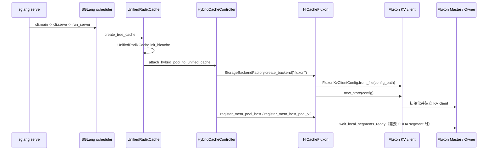
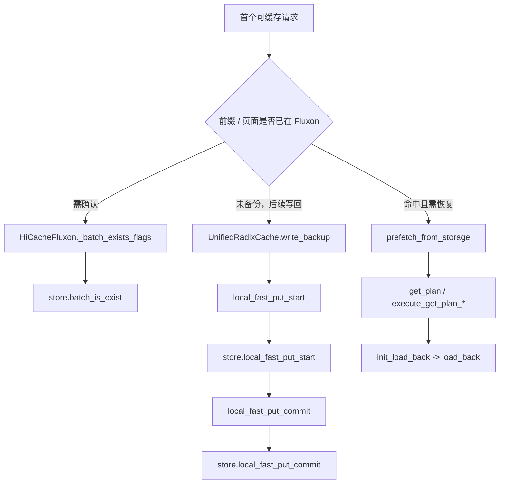

# SGLang 启动到首次使用 Fluxon 调用链

## 结论

仓库已经有 **SGLang + Fluxon 的封闭实验覆盖层**，并记录了三节点端到端验收；在该覆盖层中，SGLang 启动时可以创建 <code>HiCacheFluxon</code>，随后通过 Fluxon KV client 使用 Fluxon。

当前检出的标准 SGLang 源码不能直接以 <code>--hicache-storage-backend fluxon</code> 启动。它的 <code>StorageBackendFactory</code> 没有注册 <code>fluxon</code>，<code>ServerArgs</code> 的内置后端选项也不包含 <code>fluxon</code>。因此，实验覆盖层是当前可用集成，尚不是可从本仓库普通 SGLang 目录直接安装和启动的公开集成。

本文的观察范围是 LLM SGLang 的 HiCache 启动、首次创建 Fluxon client，以及第一次命中、写回或恢复时进入 Fluxon 数据面的调用。运行前需要可用的 Fluxon Master 路由和 Owner 节点；本文不把某一条本地调用误写成整个集群已经完成分配、复制或回收。

## 支持边界

| 运行形态 | 结论 | 代码或证据 |
| --- | --- | --- |
| 当前检出的标准 SGLang | 不可直接使用 <code>fluxon</code> 后端 | <code>StorageBackendFactory</code> 只注册了 <code>file</code>、<code>nixl</code>、<code>mooncake</code>、<code>hf3fs</code>、<code>aibrix</code>、<code>eic</code>、<code>simm</code>；<code>ServerArgs</code> 的 choices 也未含 <code>fluxon</code>。 |
| 封闭实验覆盖层 | 已经可以运行，安装脚本会验证注册、Python 模块、CUDA kernel 和 PyO3 ABI | <code>prepare_fluxon_f_gpu_runtime.sh</code> 将补丁装入隔离 venv，并要求 <code>"fluxon"</code> 已在 factory registry 中。 |
| 仓库中的历史实验 launcher | 仅作实验溯源，部分依赖仓库外发布物和路径 | 不作为可复制的公开启动方式。 |

这里的“封闭”表示启动所需的 sealed SGLang base、Fluxon wheel、原生库和补丁不全在当前工作树中；即使当前工作树保留了补丁源，也不能据此推导出普通环境可复现。

## 启动前的产物与门禁

实验运行时通过 <code>sglang_fluxon_integration/experiment_configs/mooncake_trace_local_dram_tp2x2_20260728/prepare_fluxon_f_gpu_runtime.sh</code> 组装。它会：

1. 校验 sealed release、base venv、Fluxon wheel、CUDA 工具链和补丁文件。
2. 创建隔离 venv，复制 sealed SGLang，并写入 <code>memory_pool_host.py</code>、<code>unified_radix_cache.py</code>、<code>storage/fluxon/hicache_fluxon.py</code> 和 <code>scheduler.py</code> 的选定补丁。
3. 校验各产物 SHA-256；导入 SGLang、Fluxon 和 adapter。
4. 断言 <code>StorageBackendFactory._registry</code> 包含 <code>"fluxon"</code>，并检查 <code>KvClient.local_fast_put_start</code> 的原生 ABI 参数。

该脚本的 <code>config_path</code> 由 HiCacheFluxon 的 <code>extra_config</code> 提供。adapter 会用 <code>FluxonKvClientConfig.from_file(config_path)</code> 读取 Fluxon client 配置；配置文件应指向已就绪的 Fluxon 集群，而不是依赖 SGLang 在本地临时生成 Master 或 Owner。

## 从 <code>sglang serve</code> 到 Fluxon store

<code>sglang serve</code> 是当前 SGLang 的推荐启动入口。实验覆盖层在解析出 <code>hicache_storage_backend=fluxon</code> 后，经过以下路径创建 store：

<code>new_store(config)</code> 是 SGLang 启动阶段第一次实际调用 Fluxon runtime 的位置。它成功只说明 client 已完成初始化；随后是否访问到某个 Owner、是否发生写入或恢复，取决于请求的缓存状态与 HiCache 策略。

### VSCode 跳转表：启动与初始化

在 VSCode 中可对下列 <code>路径:行号</code> 使用“转到文件”或 Ctrl/Cmd+单击。带“覆盖层”的文件是封闭运行时实际安装的补丁源，而不是当前标准 SGLang 会自动加载的文件。

| 阶段 | 函数入口 | 位置 | 作用 |
| --- | --- | --- | --- |
| CLI 分派 | <code>main</code> | <code>sglang_fluxon_integration/sglang/python/sglang/cli/main.py:12</code> | 将 <code>sglang serve</code> 分派给 <code>serve</code>。 |
| LLM 启动 | <code>serve</code> | <code>sglang_fluxon_integration/sglang/python/sglang/cli/serve.py:49</code> | 解析 <code>ServerArgs</code>，调用 <code>run_server</code>。 |
| 默认 HTTP 路径 | <code>run_server</code> | <code>sglang_fluxon_integration/sglang/python/sglang/launch_server.py:15</code> | 默认分支进入 HTTP server。 |
| 启动调度进程 | <code>launch_server</code> | <code>sglang_fluxon_integration/sglang/python/sglang/srt/entrypoints/http_server.py:2452</code> | 启动 Tokenizer、Scheduler、Detokenizer 与 HTTP server。 |
| 构造前缀缓存 | <code>_create_unified_radix_cache</code> | <code>sglang_fluxon_integration/sglang/python/sglang/srt/mem_cache/registry.py:142</code> | 创建 <code>UnifiedRadixCache</code>，并在启用 HiCache 时调用 <code>init_hicache</code>。 |
| 覆盖层 HiCache 初始化 | <code>UnifiedRadixCache.init_hicache</code> | <code>sglang_fluxon_integration/experiment_configs/e44_local_slot_tier_20260716/unified_radix_cache_e44_r61_tp_execute_commit.py:1027</code> | 读取 <code>hicache_storage_backend</code>，要求 hostless layer-batched DMA 使用 <code>fluxon</code>，再装配混合池。 |
| 装配 host pool / controller | <code>attach_hybrid_pool_to_unified_cache</code> | <code>sglang_fluxon_integration/sglang/python/sglang/srt/mem_cache/hybrid_cache/hybrid_pool_assembler.py:1089</code> | 创建 <code>HybridCacheController</code>，把后端名称及 extra config 传入。 |
| 创建后端 | <code>HiCacheController.attach_storage_backend</code> | <code>sglang_fluxon_integration/sglang/python/sglang/srt/managers/cache_controller.py:414</code> | 通过 factory 创建后端，并先注册主 host pool。 |
| factory 契约 | <code>StorageBackendFactory.create_backend</code> | <code>sglang_fluxon_integration/sglang/python/sglang/srt/mem_cache/storage/backend_factory.py:66</code> | 标准检出只接受已注册后端或 <code>dynamic</code>；本身未注册 Fluxon。 |
| 覆盖层注册门禁 | import gate | <code>sglang_fluxon_integration/experiment_configs/mooncake_trace_local_dram_tp2x2_20260728/prepare_fluxon_f_gpu_runtime.sh:177</code> | 验证隔离运行时的 <code>fluxon</code> registry、adapter、原生库和 ABI。 |
| Fluxon adapter | <code>HiCacheFluxon.__init__</code> | <code>sglang_fluxon_integration/experiment_configs/e44_local_slot_tier_20260716/hicache_fluxon_e44_r54_prefetch_timeline_observe.py:782</code> | 读取 <code>config_path</code>，创建 Fluxon store。 |
| 读取 client 配置 | <code>FluxonKvClientConfig.from_file</code> | <code>fluxon_py/config.py:804</code> | 解析与校验 Fluxon client 配置。 |
| **首次 Fluxon runtime 调用** | <code>new_store</code> | <code>sglang_fluxon_integration/experiment_configs/e44_local_slot_tier_20260716/hicache_fluxon_e44_r54_prefetch_timeline_observe.py:931</code>；实现 <code>fluxon_py/kvclient/__init__.py:106</code> | 初始化 KV client；失败时 adapter 终止 SGLang 启动。 |
| host segment 注册 | <code>register_mem_host_pool_v2</code> | <code>sglang_fluxon_integration/experiment_configs/e44_local_slot_tier_20260716/hicache_fluxon_e44_r54_prefetch_timeline_observe.py:1149</code> | 注册附加 host pool；CUDA 直连恢复需要时再注册外部 segment。 |

## 第一次请求到第一次 Fluxon 数据面调用

第一次请求没有固定地“先写再读”。首次数据面动作取决于该请求看到的是未备份缓存、已在 Fluxon 中的前缀，还是已驱逐但可恢复的前缀。

| 请求状态 | SGLang 入口 | adapter / Fluxon 调用 | 含义 |
| --- | --- | --- | --- |
| 评估后端是否已有 key | adapter <code>_batch_exists_flags</code> | <code>store.batch_is_exist</code>，降级时 <code>store.is_exist</code> | 首次普通元数据查询；可能在写回前用于排除已存在 key。 |
| 缓存节点需要写回 | <code>UnifiedRadixCache.write_backup</code> | <code>local_fast_put_start</code> → <code>store.local_fast_put_start</code> → <code>local_fast_put_commit</code> → <code>store.local_fast_put_commit</code> | hostless 快路径先提交 page-value 写入计划，随后提交该计划。 |
| Fluxon 命中且节点已驱逐 | <code>prefetch_from_storage</code>，随后 <code>init_load_back</code> | <code>get_plan</code> → <code>execute_get_plan_cpu</code> 或 <code>execute_get_plan_gpu</code>；另一条 transfer 路径使用 <code>get_transfer</code> | 先制订读取计划，随后恢复至 SGLang 的 host/device KV 空间。 |

### VSCode 跳转表：数据面

| 场景 | 函数入口 | 位置 |
| --- | --- | --- |
| 首次存在性查询 | <code>HiCacheFluxon._batch_exists_flags</code> | <code>sglang_fluxon_integration/experiment_configs/e44_local_slot_tier_20260716/hicache_fluxon_e44_r54_prefetch_timeline_observe.py:1153</code> |
| adapter 写入开始 | <code>HiCacheFluxon.local_fast_put_start</code> | <code>sglang_fluxon_integration/experiment_configs/e44_local_slot_tier_20260716/hicache_fluxon_e44_r54_prefetch_timeline_observe.py:3017</code> |
| adapter 写入提交 | <code>HiCacheFluxon.local_fast_put_commit</code> | <code>sglang_fluxon_integration/experiment_configs/e44_local_slot_tier_20260716/hicache_fluxon_e44_r54_prefetch_timeline_observe.py:3146</code> |
| 写回入口 | <code>UnifiedRadixCache.write_backup</code> | <code>sglang_fluxon_integration/experiment_configs/e44_local_slot_tier_20260716/unified_radix_cache_e44_r61_tp_execute_commit.py:5650</code> |
| 写入计划提交 | <code>_fluxon_local_fast_put_start_with_conflict_reconcile</code> | <code>sglang_fluxon_integration/experiment_configs/e44_local_slot_tier_20260716/unified_radix_cache_e44_r61_tp_execute_commit.py:3473</code> |
| 计划 commit | <code>_finish_fluxon_hostless_write_batch</code> 中的 <code>local_fast_put_commit</code> | <code>sglang_fluxon_integration/experiment_configs/e44_local_slot_tier_20260716/unified_radix_cache_e44_r61_tp_execute_commit.py:4333</code> |
| 预取入口 | <code>UnifiedRadixCache.prefetch_from_storage</code> | <code>sglang_fluxon_integration/experiment_configs/e44_local_slot_tier_20260716/unified_radix_cache_e44_r61_tp_execute_commit.py:6708</code> |
| 读取计划 | <code>HiCacheFluxon.get_plan</code> | <code>sglang_fluxon_integration/experiment_configs/e44_local_slot_tier_20260716/hicache_fluxon_e44_r54_prefetch_timeline_observe.py:3296</code> |
| 执行 CPU / GPU 读取计划 | <code>execute_get_plan_cpu</code> / <code>execute_get_plan_gpu</code> | <code>sglang_fluxon_integration/experiment_configs/e44_local_slot_tier_20260716/hicache_fluxon_e44_r54_prefetch_timeline_observe.py:3329</code> / <code>sglang_fluxon_integration/experiment_configs/e44_local_slot_tier_20260716/hicache_fluxon_e44_r54_prefetch_timeline_observe.py:3348</code> |
| 恢复入口 | <code>UnifiedRadixCache.init_load_back</code> | <code>sglang_fluxon_integration/experiment_configs/e44_local_slot_tier_20260716/unified_radix_cache_e44_r61_tp_execute_commit.py:8406</code> |
| 执行恢复 | <code>UnifiedRadixCache.load_back</code> | <code>sglang_fluxon_integration/experiment_configs/e44_local_slot_tier_20260716/unified_radix_cache_e44_r61_tp_execute_commit.py:5780</code> |

## 已有实验效果与适用范围

已有实验记录证明封闭覆盖层能完成三节点 SGLang 压力，但数字只适用于对应模型、容量、拓扑、调度和请求集，不能代表普通 SGLang 或任意 Fluxon 集群的通用吞吐。

| 实验记录 | 已记录结果 | 适用边界 |
| --- | --- | --- |
| E44 r9 | <code>2304/2304</code> 成功，<code>5.609336 QPS</code>，总命中率 <code>60.0939%</code> | 两个 TP=2 GPU 节点与一个 CPU 节点、指定 session-stream 冷启动。 |
| E16bj | <code>1152/1152</code>、严格 <code>576/576</code>，<code>10.045299 QPS</code>，总命中率 <code>92.99%</code> | 三机冷启动、固定 GPU/CPU owner 容量和重建后的 closed core。 |

详情见 <code>fluxon_doc_cn/design/sglang_fluxon_kv集成设计.md:843</code> 和 <code>fluxon_doc_cn/design/sglang_fluxon_kv集成设计.md:1627</code>。这些结果验证了已选择的封闭组合版本；它们没有消除公开化所需的后端注册、参数 parser、发布物和可复现启动脚本缺口。

## 公开化前必须补齐的条件

要让“标准 SGLang 可用 Fluxon”成为稳定结论，至少需要把以下项变为同一版本化发布物，并加入可在仓库内运行的验收：

1. 为 <code>StorageBackendFactory</code> 注册 <code>fluxon</code>，并提供与 <code>HiCacheFluxon</code> 构造签名相符的创建分支。
2. 在 <code>ServerArgs</code> 中将 <code>fluxon</code> 作为受支持后端，并明确 <code>config_path</code> 的唯一配置入口。
3. 将 <code>HiCacheFluxon</code>、<code>UnifiedRadixCache</code>、scheduler 和所需 CUDA/PyO3 产物以可追踪版本一起发布。
4. 提供不依赖仓库外绝对路径的测试环境配置与 SGLang 启动入口；启动前校验 Master/Owner 可达，启动后验证 <code>new_store</code>、一次写回和一次恢复。

在这些条件完成前，应按“封闭实验集成已验证”安排部署，而不应把 <code>--hicache-storage-backend fluxon</code> 作为当前标准 SGLang 的公开契约。
